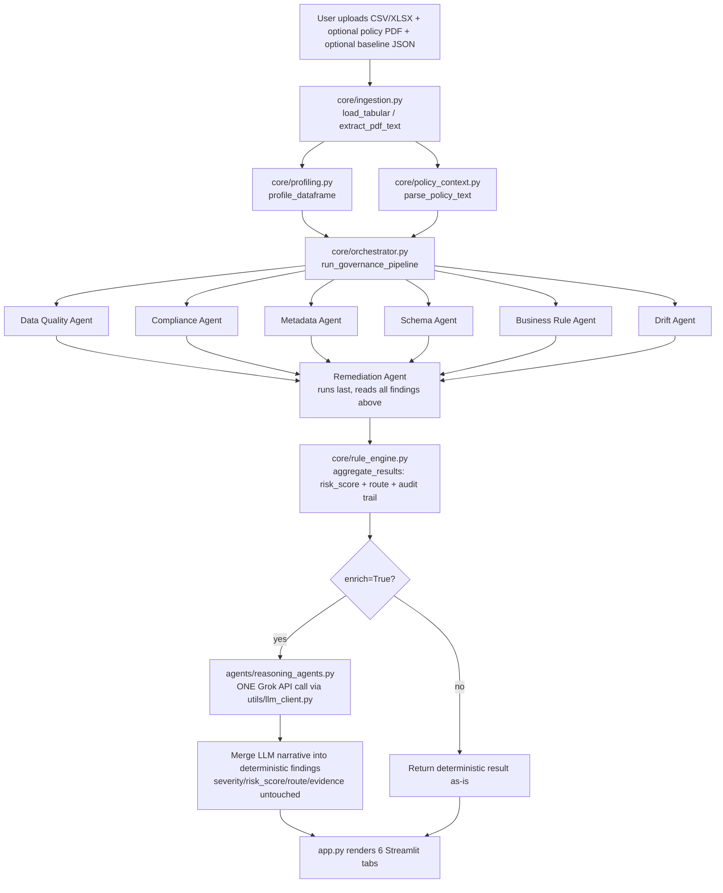

# Architecture

This document explains how EnterGov Agent actually works, in the order you
should read the code, and is honest about what this project is (and isn't).

## What this project actually is

**It is not a LangGraph project.** There is no `langgraph` dependency, no
`StateGraph`, no nodes/edges, no conditional routing between agents, and no
shared mutable state object passed between them. `requirements.txt` never
listed `langgraph` even before this rewrite.

What it actually is: a **linear, deterministic Python pipeline** with seven
independently-callable modules under `agents/` (six "checker" agents run in
a fixed order, plus one "remediation" agent that runs last), followed by a
single optional LLM call that adds human-readable narrative on top of the
deterministic output. Each agent function takes plain data in (a DataFrame
and/or a profile dict) and returns a plain `AgentResult` out — there's no
message-passing, no memory between agents, and no agent can see another
agent's output except the Remediation Agent (which is deliberately run last
and handed everyone else's combined findings).

"Multi-agent" here means "multiple independent scoring modules," not
"multiple LLM-driven agents that reason and coordinate." Only one LLM call
happens in the entire pipeline, and it does not make decisions — it only
narrates decisions the deterministic code already made (see
`agents/reasoning_agents.py`'s explicit rule: the LLM is not allowed to
change `severity`, `risk_score`, `route`, or any evidence field).

If you want this to become a real LangGraph project — e.g. to add
conditional routing (skip Drift Agent if no baseline was uploaded, retry
the LLM call with backoff, let agents run in parallel, add a supervisor
that decides which agents to invoke based on file type) — that would mean:
1. Define a `TypedDict` state schema mirroring the `result` dict `core/orchestrator.py` builds today.
2. Wrap each `agents/*.py::run()` call as a graph node.
3. Replace the hardcoded call sequence in `run_governance_pipeline()` with `StateGraph` edges.
4. Add `langgraph` to `requirements.txt`.
None of that exists yet — flagging it so you don't assume it does.

## Recommended reading order

| Order | File | Why |
|---|---|---|
| 1 | `README.md` | What the app does, how to run it |
| 2 | `ARCHITECTURE.md` (this file) | The real flow, before you read code |
| 3 | `core/models.py` | `Finding` / `AgentResult` — the shared data contract every other file depends on |
| 4 | `core/orchestrator.py` | The pipeline entry point — read this to see the exact call order |
| 5 | `core/ingestion.py`, `core/profiling.py`, `core/policy_context.py` | The three inputs the pipeline is built from |
| 6 | `agents/data_quality_agent.py` → `agents/drift_agent.py` → `agents/remediation_agent.py` | The six checker agents, in the order `orchestrator.py` calls them, then the remediation agent that runs last |
| 7 | `core/rule_engine.py` | How raw findings become risk scores + routing decisions |
| 8 | `agents/reasoning_agents.py` | The single LLM enrichment call and its deterministic fallback |
| 9 | `utils/llm_client.py` | The Grok (xAI) API wrapper — the only file that talks to an LLM provider |
| 10 | `utils/intent_router.py`, `utils/data_query.py` | Chat-tab intent classification and LLM-free local answers |
| 11 | `app.py` | Streamlit UI — wires everything above to six tabs |
| 12 | `ui/components.py` | Shared rendering helpers used by `app.py` |

## Flow diagram

## The Grok integration, specifically

`utils/llm_client.py` is the only file that imports `openai` or knows the
xAI base URL. Everything else calls `stream_answer()` / `complete_text()` /
`governance_prompt()` / `general_prompt()` and never touches the provider
directly. If Grok is unreachable or `XAI_API_KEY` isn't set, every call
degrades to a canned response (`_quiet_fallback()`) instead of crashing —
the whole app remains usable without an API key, just with generic
narrative text instead of Grok-generated explanations.

Only **one** LLM call happens per governance scan (`generate_scan_narrative`
in `agents/reasoning_agents.py`), covering every finding at once — not one
call per finding. This was already true in the pre-migration version of
this code and is preserved as-is; it matters for cost and latency on large
datasets.

## Known gaps (things that look implemented but aren't, fully)

These aren't bugs exactly — the app works — but they're worth knowing
before you present this as "production-grade governance," since some UI
elements imply more than the code currently does:

- **`integrity` and `timeliness` DQ dimensions are hardcoded to 100** in
  `agents/data_quality_agent.py::run()` — there's no actual check computing
  them. The Executive Dashboard's quality score is a weighted average that
  includes these two fixed values.
- **Policy rules aren't compiled into executable checks.** `core/policy_context.py`
  extracts rule *text* from a PDF via regex, but nothing in `agents/business_rule_agent.py`
  or elsewhere turns e.g. "PII must be masked" into an actual masking check —
  `BUS-POLICY-MAP-001` just reports how many rules were loaded.
- **Metadata catalog's `lineage_status` and `certification_status` are static
  placeholders** (`"Unknown"` / `"Uncertified"`) in `agents/metadata_agent.py` —
  there's no real lineage or certification data source wired in.
- **Schema Agent's rename detection is a fuzzy string match** (`difflib.get_close_matches`,
  cutoff 0.72) on column *names* only — it doesn't compare data content, so it
  can misfire on similarly-named but unrelated columns.
- **No persistence.** Every scan result lives only in Streamlit's
  `st.session_state` for that browser session; nothing is written to a
  database. Refreshing the page loses the scan.
- **No automated tests.** There is no `tests/` directory. Given the amount of
  business logic in the agent files (thresholds, regex patterns, scoring
  formulas), this is the single highest-leverage thing to add before calling
  this production-ready.
